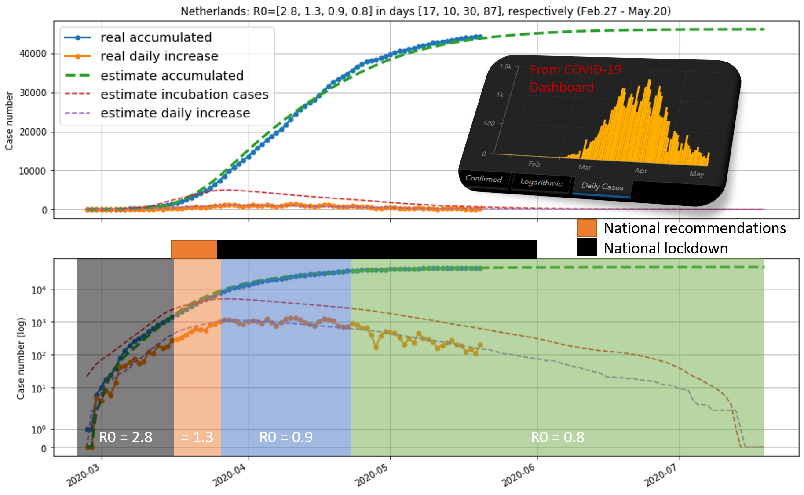

# corona_model_R0_LSTM
corona cases prediction using generative model (i.e., R0 model, 'corona_model_R0_v1.py') and discriminative model (i.e., LSTM model, 'corona_model_LSTM_v1.py').

Prediction using the R0 model:

